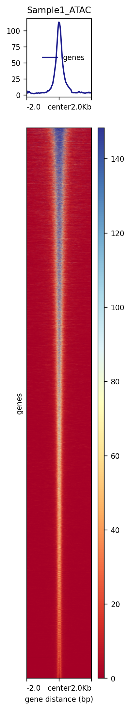
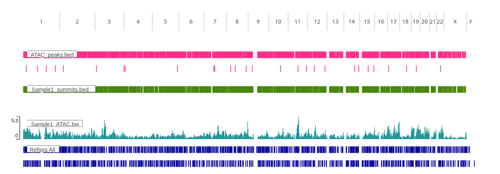

# ATAC-seq

## STEP 1 — Create ATAC-seq environment
```
# Create and activate environment
conda create -n ATAC_seq python=3.10 -y
conda activate ATAC_seq

# Configure channels
conda config --add channels defaults
conda config --add channels bioconda
conda config --add channels conda-forge
conda config --set channel_priority flexible

# Install mamba
conda install -y -c conda-forge mamba

# Install general tools
mamba install -y sambamba deeptools multiqc bioconductor-diffbind trim-galore bowtie2 macs2=2.2.7.1 picard bedtools
```

## STEP 2 — Download reference genome and build Bowtie2 index
```
# Create Bowtie2 index directory
mkdir -p Genome_Index/Bowtie2_hg38
cd Genome_Index/Bowtie2_hg38

# Download GENCODE hg38 primary assembly
wget https://ftp.ebi.ac.uk/pub/databases/gencode/Gencode_human/release_49/GRCh38.primary_assembly.genome.fa.gz

# Unzip
gunzip GRCh38.primary_assembly.genome.fa.gz

# Build Bowtie2 index
bowtie2-build GRCh38.primary_assembly.genome.fa GRCh38.primary_assembly.genome
```

## STEP 3 — Download ENCODE blacklist regions
```
mkdir -p Genome_Index/ENCODE_BlackList
cd Genome_Index/ENCODE_BlackList

wget https://github.com/Boyle-Lab/Blacklist/raw/master/lists/hg38-blacklist.v2.bed.gz
gunzip hg38-blacklist.v2.bed.gz
```

## STEP 4 — Download example ATAC-seq dataset
```
mkdir -p ATAC_Dataset/{raw,trimmed,Alignment,Homer,MACS2}
 
# For demonstration, we will assume you have:
# ~/ATAC_Dataset/raw/Sample1_R1_001.fastq.gz (Read 1)
# ~/ATAC_Dataset/raw/Sample1_R2_001.fastq.gz (Read 2)

cd ATAC_Dataset/raw

prefetch Sample1	
fasterq-dump --split-files Sample1/Sample1.sra

gzip Sample1_R1_001.fastq
gzip Sample1_R2_001.fastq
```

## STEP 5 — Adapter Trimming + FastQC
```
mkdir -p ATAC_Dataset/trimmed/Sample1

trim_galore \
    --fastqc \
    --paired \
    --cores 2 \
    --quality 20 \
    --stringency 3 \
    --length 20 \
    --output_dir ATAC_Dataset/trimmed/Sample1 \
    ATAC_Dataset/raw/Sample1_R1_001.fastq.gz \
    ATAC_Dataset/raw/Sample1_R2_001.fastq.gz
```

## STEP 6 — Align Reads to the Reference Genome
```
mkdir -p ATAC_Dataset/Alignment/Sample1

bowtie2 \
    -x Genome_Index/Bowtie2_hg38/GRCh38.primary_assembly.genome \
    -1 ATAC_Dataset/trimmed/Sample1/Sample1_R1_001_val_1.fq.gz \
    -2 ATAC_Dataset/trimmed/Sample1/Sample1_R2_001_val_2.fq.gz \
    -p 2 \
    --very-sensitive \
    --no-mixed \
    --no-discordant \
    --no-unal \
    -S ATAC_Dataset/Alignment/Sample1/Sample1.sam
```

## STEP 7 — Process and Quality Control Alignments
```
# Convert SAM → BAM
samtools view -@ 2 -h -S -b ATAC_Dataset/Alignment/Sample1/Sample1.sam > ATAC_Dataset/Alignment/Sample1/Sample1.bam
rm ATAC_Dataset/Alignment/Sample1/Sample1.sam

# Sort
samtools sort -@ 2 ATAC_Dataset/Alignment/Sample1/Sample1.bam -o ATAC_Dataset/Alignment/Sample1/Sample1.sorted.bam
rm ATAC_Dataset/Alignment/Sample1/Sample1.bam

# Add read groups to the BAM file
 picard AddOrReplaceReadGroups \
  I=ATAC_Dataset/Alignment/Sample1/Sample1.sorted.bam \
  O=ATAC_Dataset/Alignment/Sample1/Sample1.sorted_RG.bam \
  RGID=Sample1 \
  RGLB=ATAC \
  RGPL=ILLUMINA \
  RGPU=unit1 \
  RGSM=Sample1 \
  VALIDATION_STRINGENCY=LENIENT

#  Index the BAM
samtools index ATAC_Dataset/Alignment/Sample1/Sample1.sorted_RG.bam

# Mark and remove PCR duplicates
picard MarkDuplicates \
  I=ATAC_Dataset/Alignment/Sample1/Sample1.sorted_RG.bam \
  O=ATAC_Dataset/Alignment/Sample1/Sample1.sorted_dedup.bam \
  M=ATAC_Dataset/Alignment/Sample1/Sample1.sorted_dedup_metrics.txt \
  REMOVE_DUPLICATES=true \
  VALIDATION_STRINGENCY=LENIENT
  
# Insert size distribution
picard CollectInsertSizeMetrics \
  I=ATAC_Dataset/Alignment/Sample1/Sample1_final.bam \
  O=ATAC_insert_metrics.txt \
  H=ATAC_insert_histogram.pdf \
  M=0.5

# Index deduplicated BAM
samtools index ATAC_Dataset/Alignment/Sample1/Sample1.sorted_dedup.bam

# Filter for high-quality alignments
sambamba view \
  -h \
  -f bam \
  -F "[XS] == null and not unmapped and not duplicate and mapping_quality >= 30" \
  -t 2 \
  ATAC_Dataset/Alignment/Sample1/Sample1.sorted_dedup.bam \
  -o ATAC_Dataset/Alignment/Sample1/Sample1.sorted_filtered.bam
  
# Index final filtered BAM
samtools index ATAC_Dataset/Alignment/Sample1/Sample1.sorted_filtered.bam

# Filter out blacklisted regions
bedtools intersect -v \
    -abam ATAC_Dataset/Alignment/Sample1/Sample1.sorted_filtered.bam \
    -b Genome_Index/ENCODE_BlackList/hg38-blacklist.v2.bed \
    > ATAC_Dataset/Alignment/Sample1/Sample1.sorted_blacklist_removed.bam

# Index blacklist BAM
samtools index ATAC_Dataset/Alignment/Sample1/Sample1.sorted_blacklist_removed.bam

# Final sorting of filtered BAM
sambamba sort \
    -t 2 \
    -o ATAC_Dataset/Alignment/Sample1/Sample1_final.bam \
    ATAC_Dataset/Alignment/Sample1/Sample1.sorted_blacklist_removed.bam
 
# Read retention statistics
TOTAL=$(samtools view -c -F 260 ATAC_Dataset/Alignment/Sample1/Sample1.sorted.bam)
FINAL=$(samtools view -c -F 260 ATAC_Dataset/Alignment/Sample1/Sample1_final.bam)
PERCENT=$(echo "scale=2; 100*${FINAL}/${TOTAL}" | bc)

echo "Reads retained: ${FINAL}/${TOTAL} (${PERCENT}%)"

```

## STEP 8 — HOMER ATAC peak calling
```
mkdir -p ATAC_Dataset/Homer/Sample1


makeTagDirectory \
  ATAC_Dataset/Homer/Sample1 \
  ATAC_Dataset/Alignment/Sample1/Sample1_final.bam \
  -genome hg38

findPeaks ATAC_Dataset/Homer/Sample1 \
  -style atac \
  -fdr 0.001 \
  -o ATAC_Dataset/Homer/Sample1/ATAC_peaks.txt
```

## STEP 9 — MACS2 ATAC peak calling
```
mkdir -p ATAC_Dataset/MACS2/Sample1

macs2 callpeak \
  -t ATAC_Dataset/Alignment/Sample1/Sample1_final.bam \
  -f BAMPE \
  -g hs \
  -n Sample1 \
  --outdir ATAC_Dataset/MACS2/Sample1 \
  -q 0.01 \
  --nomodel \
  --keep-dup auto \
  --call-summits
```

## STEP 10 — Motif Discovery (HOMER)
```
findMotifsGenome.pl \
  ATAC_Dataset/MACS2/Sample1/Sample1_peaks.narrowPeak \
  hg38 \
  ATAC_Dataset/MACS2/Sample1/motifs \
  -size 200 \
  -mask
```

## STEP 11 — BigWig signal tracks (deepTools)
```
bamCoverage \
  --bam ATAC_Dataset/Alignment/Sample1/Sample1_final.bam \
  --outFileName ATAC_Dataset/MACS2/Sample1/Sample1_ATAC.bw \
  --binSize 10 \
  --normalizeUsing RPGC \
  --effectiveGenomeSize 2913022398 \
  --numberOfProcessors 2
```

## STEP 12 — Signal heatmaps around ATAC peaks
```
computeMatrix reference-point \
  --referencePoint center \
  -b 2000 -a 2000 \
  -R ATAC_Dataset/MACS2/Sample1/Sample1_peaks.narrowPeak \
  -S ATAC_Dataset/MACS2/Sample1/Sample1_ATAC.bw \
  -o ATAC_matrix.gz \
  -p 2

plotHeatmap \
  -m ATAC_matrix.gz \
  -o ATAC_heatmap.png
```



